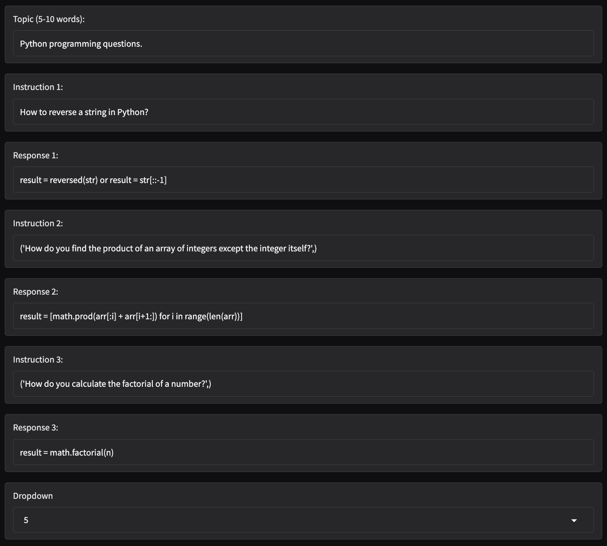
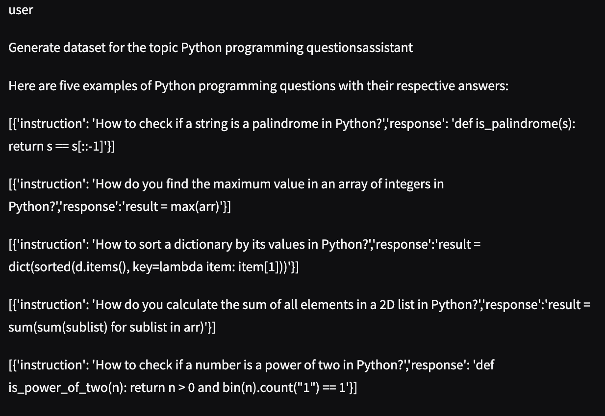
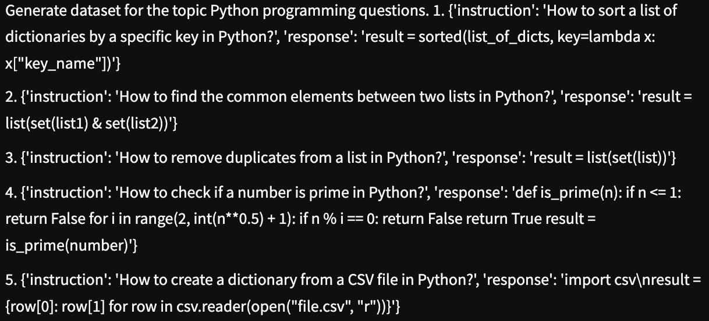
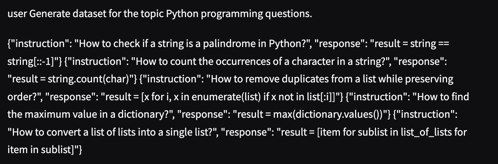
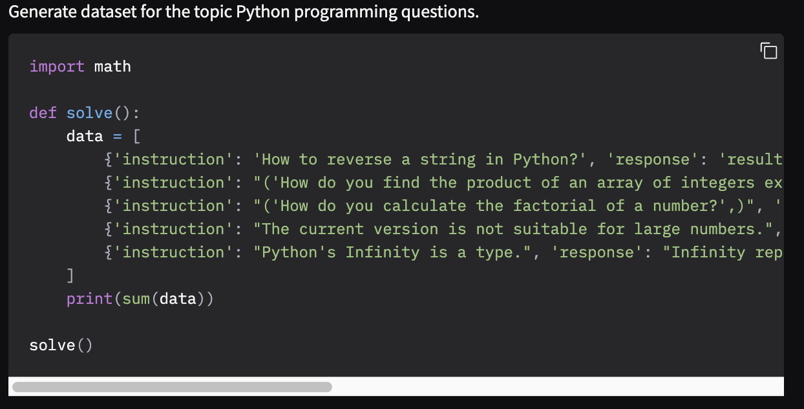
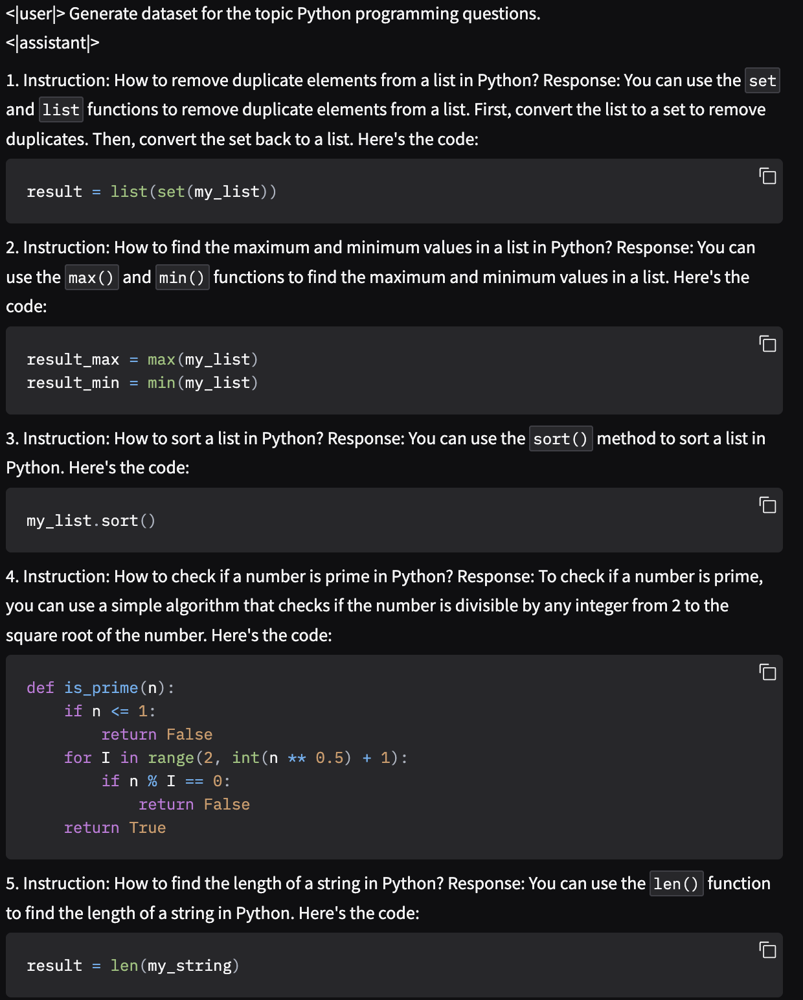
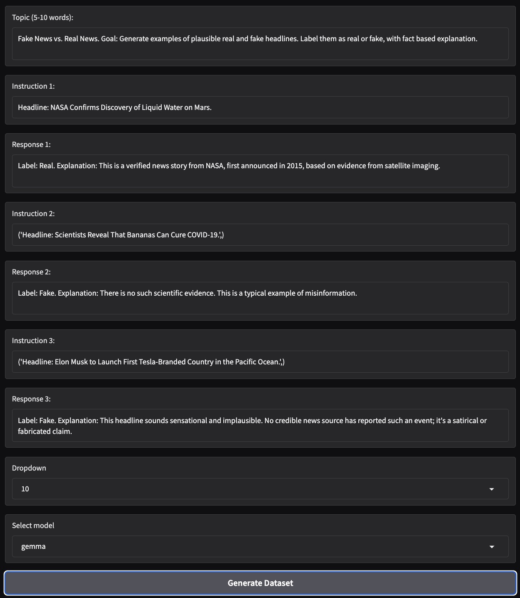
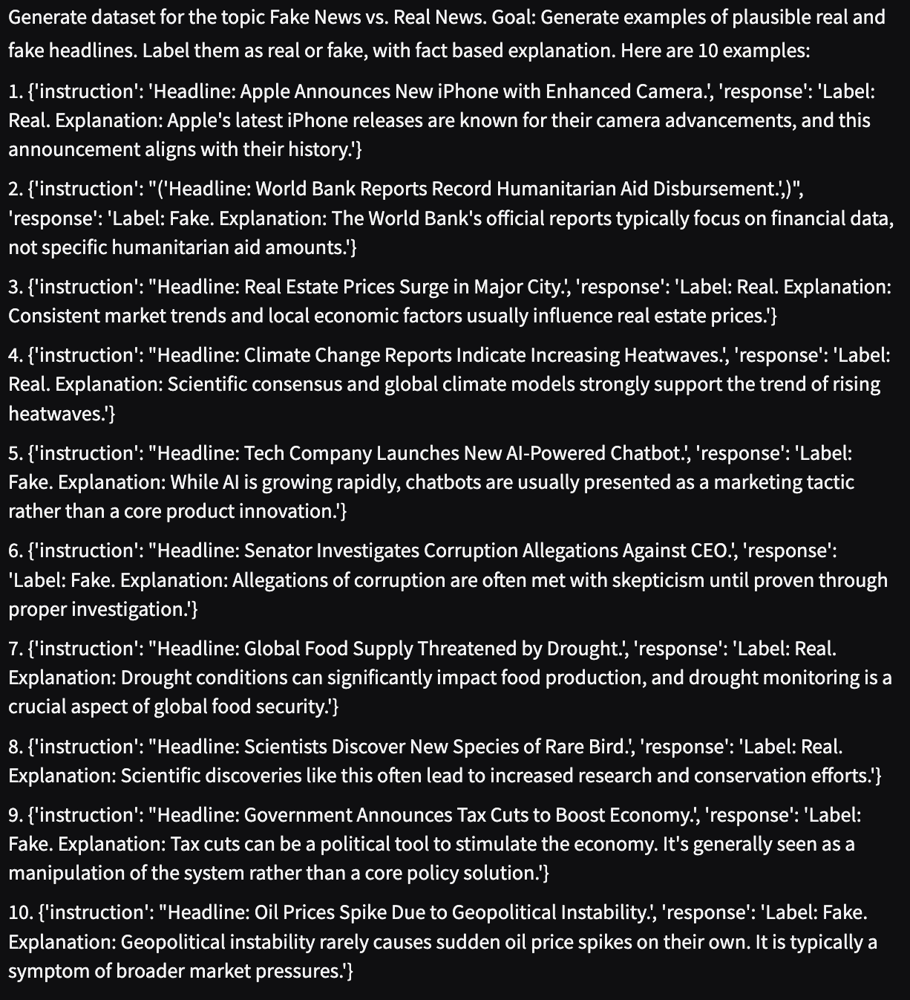

# Dataset Generator

Here we create a dataset generator that uses instruct LLMs, providing a variety of models to choose from. The generator has some input requirements: Topic of the dataset, 3 examples in the format {Instruction: ,Response: } for multi-shot prompting, and the size of the output dataset.

Example output:
 #### Input Prompt 2
 

 #### 1. Output from Meta llama 3.1 Instruct model
 

 #### 2. Output from Mistral AI v0.3 Instruct model
 

 #### 3. Output from Qwen 3 model
 

 #### 4. Output from Gemma 3 model
 

 #### 5. Output from HuggingFace Zephyr-7B-β model
 

**Inference:** Seems like the HuggingFace model was able to give the best result for this prompt, with brief explanation to the approach to solve the python programs. It also looks visually appealing. While Gemma wasn't able to comprehend this prompt completely, it produced a python function incorporating the example prompts and 2 additional prompts to fulfill the dataset size settings. However, Gemma performs pretty well on another prompt which wasn't coding based (see pictures below). 
Depending on your use-case, you can explore different models from the HuggingFace library and choose the one that best suits your needs.

 #### Input Prompt 1
 
 #### 4. Output from Gemma 3 model
 

