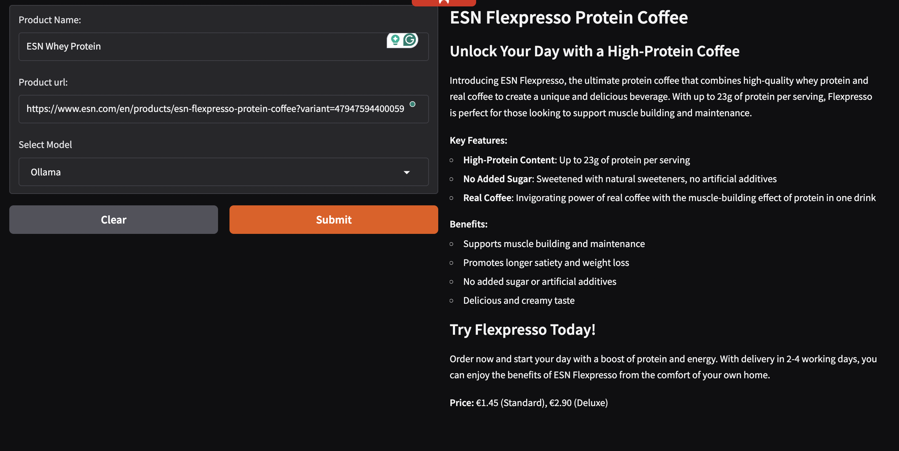
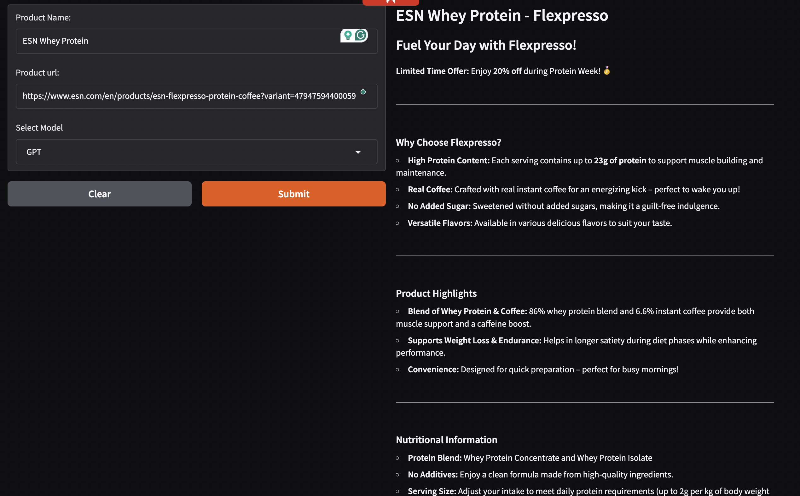
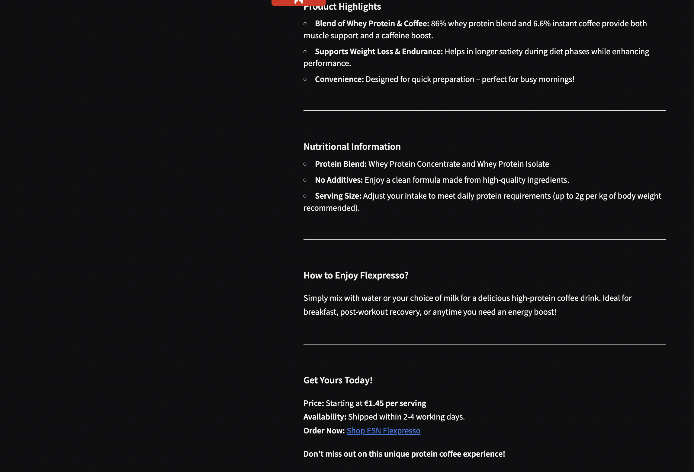
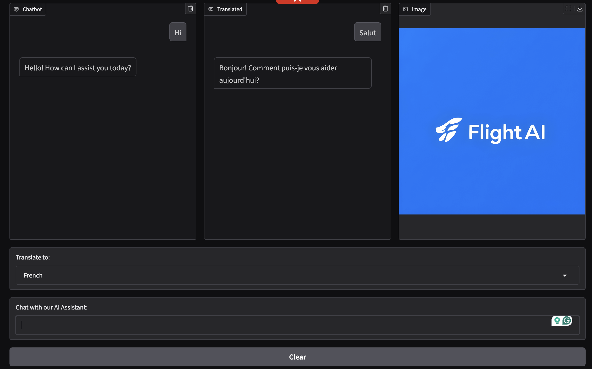
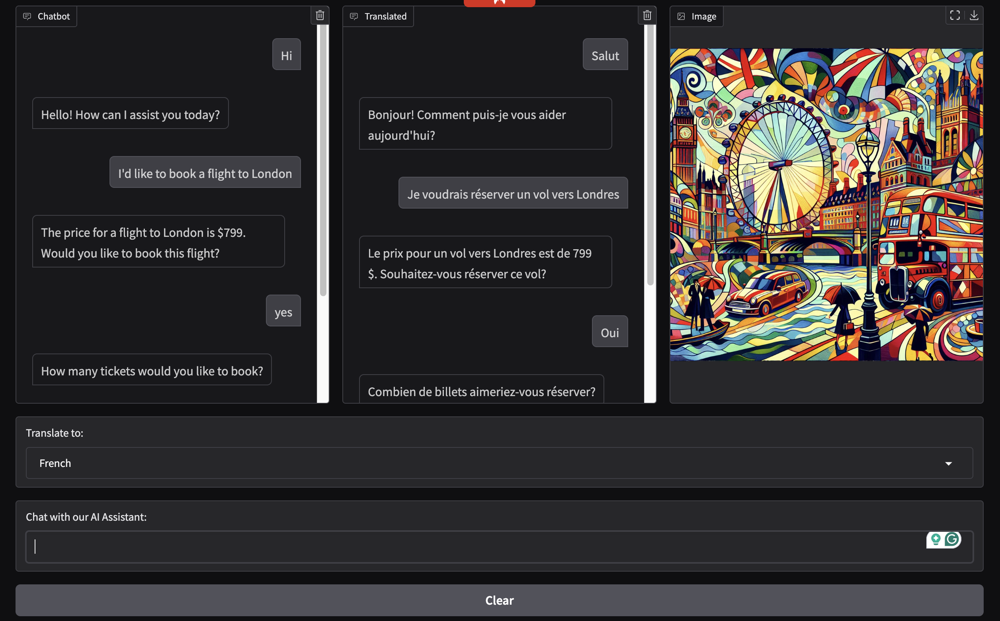
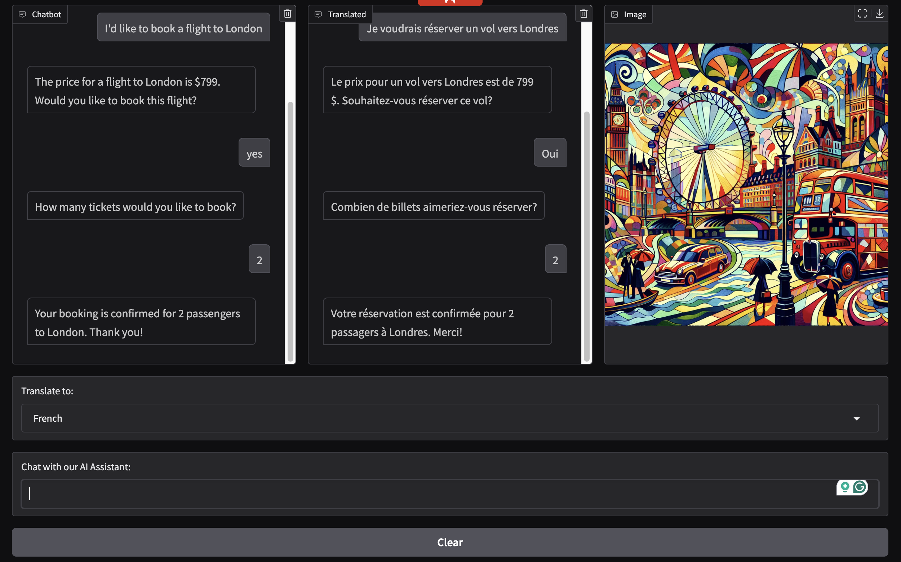
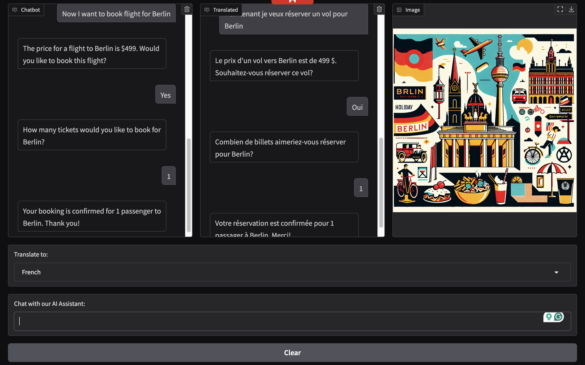
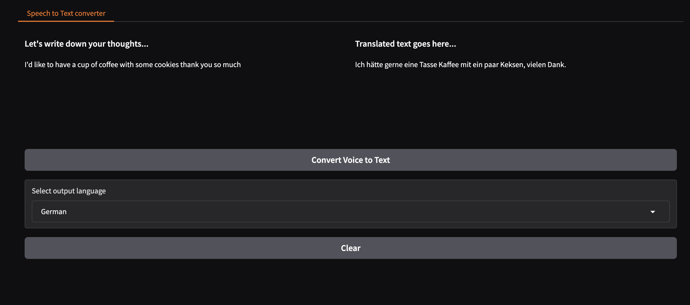

# Project on LLMs

### Project - Marketing Brochure

Here we build a tool that infers important and relevant information for a product, creates a marketing brochure for the product, and translates the brochure to another language (based on user input).

Example output is shown here:
 ### 1.
 

### 2.
 

 ### 3.
 

## Project - Airline AI Assistant

Here we create a simple AI Customer Support assistant for an Airline, which simulates booking flights, and translates the conversation in language of choice. Some extra special features about this project are, that it uses "Tools", image generation, and voice assitance. Tools are an incredibly powerful feature provided by the frontier LLMs. With tools, you can write a function, and have the LLM call that function as part of its response. 
The UI displays a vibrant image representing the city you want to book flights for. 

Example output is shown here:
 ### 1.
 

### 2.
 

 ### 3.
 

 ### 4.
 

 ## Project - Speech to Text Converter

Here we take audio input and convert speech to text, and back to speech in language of choice.

Example output is shown here:
 ### 1.
 