# Project on LLMs

## 📌 Table of Contents

- [Project on LLMs](#project-on-llms)
- [Marketing Brochure](#marketing-brochure)
- [Airline AI Assistant](#airline-ai-assistant)
- [Speech to Text Converter](#speech-to-text-converter)
- [Dataset Generator](#dataset-generator)
- [Python Code Assistant](#python-code-assistant)
- [Expert Knowledge Worker](#rag-based-expert-knowledge-worker)

### Marketing Brochure

Here we build a tool that infers important and relevant information for a product, creates a marketing brochure for the product, and translates the brochure to another language (based on user input).

Example output:

#### 1. Brochure- English Version
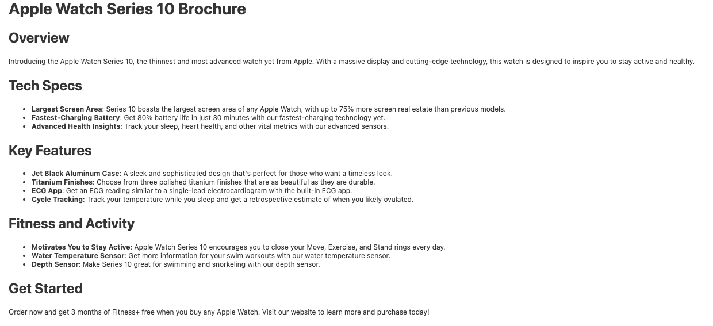

#### 2. Brochure- Translated Version
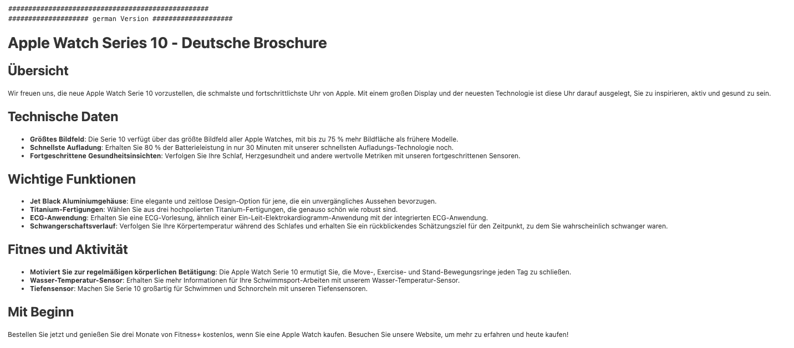

### Gradio Visualization
#### 1.
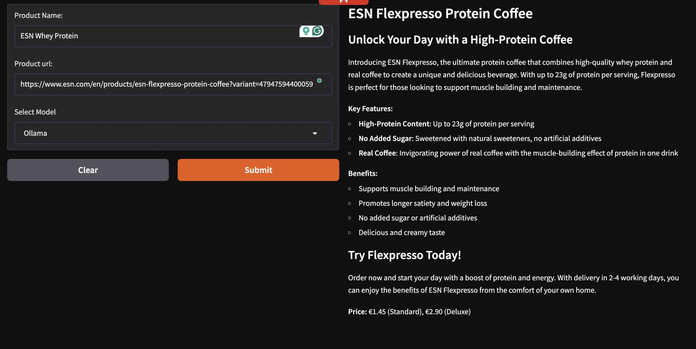

#### 2.
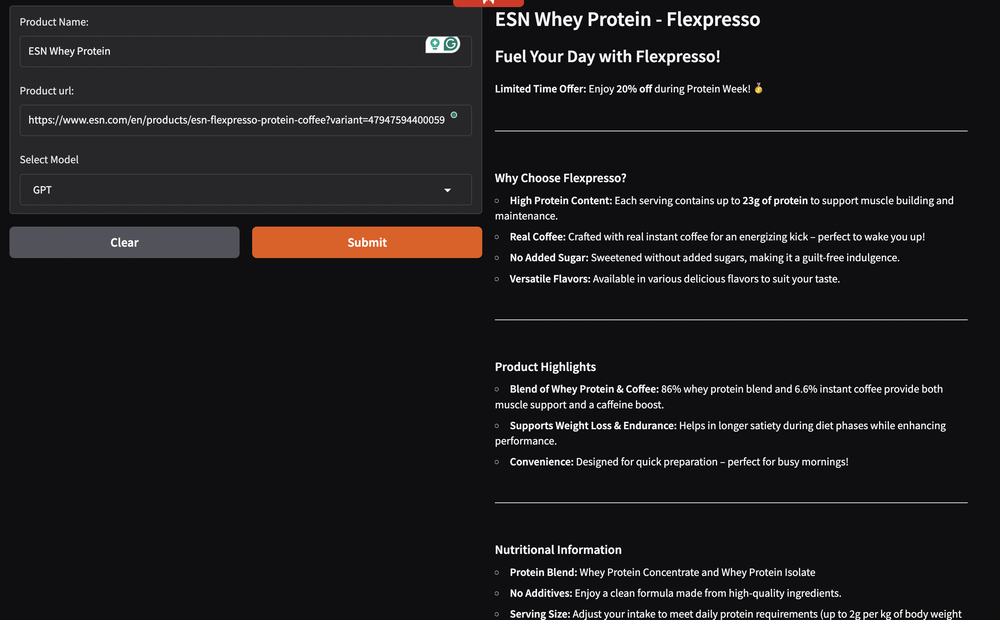

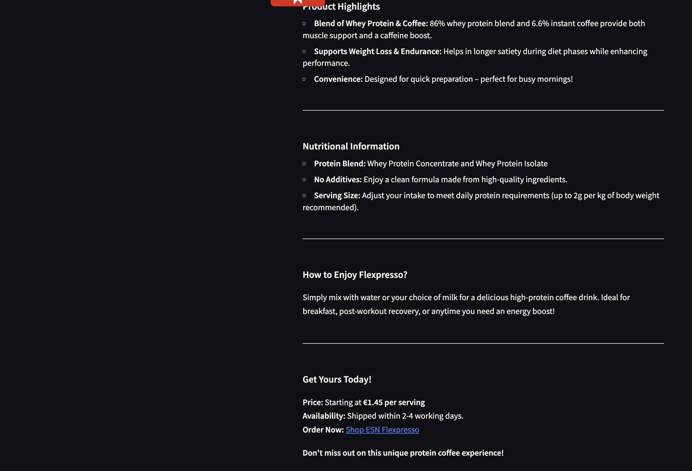

## Airline AI Assistant

Here we create a simple AI Customer Support assistant for an Airline, which simulates booking flights, and translates the conversation in language of choice. Some extra special features about this project are, that it uses "Tools", image generation, and voice assitance. Tools are an incredibly powerful feature provided by the frontier LLMs. With tools, you can write a function, and have the LLM call that function as part of its response. 
The UI displays a vibrant image representing the city you want to book flights for. 

Example output:
 #### 1.
 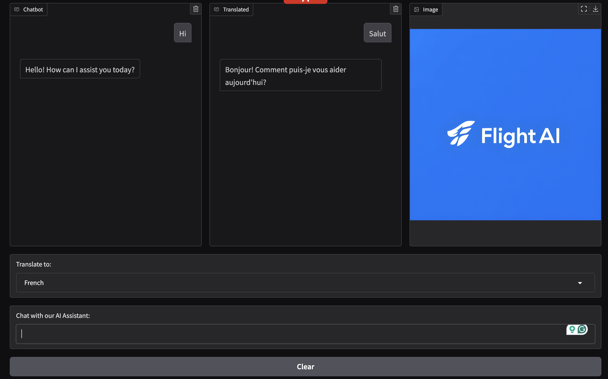

 #### 2.
 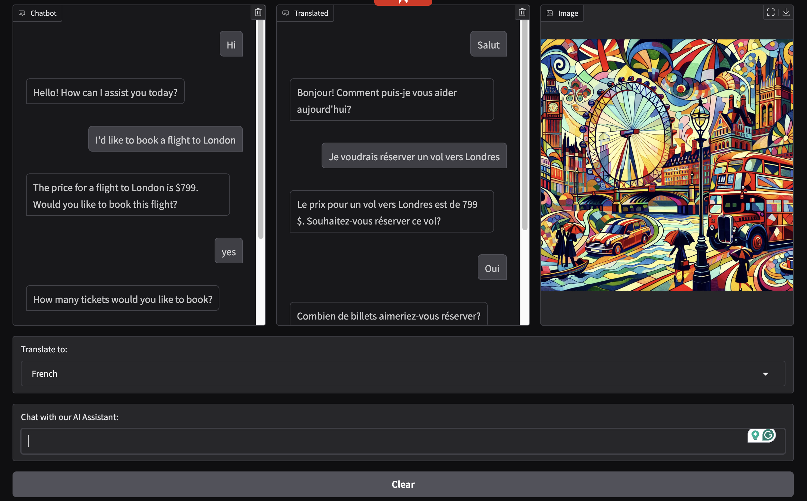

 #### 3.
 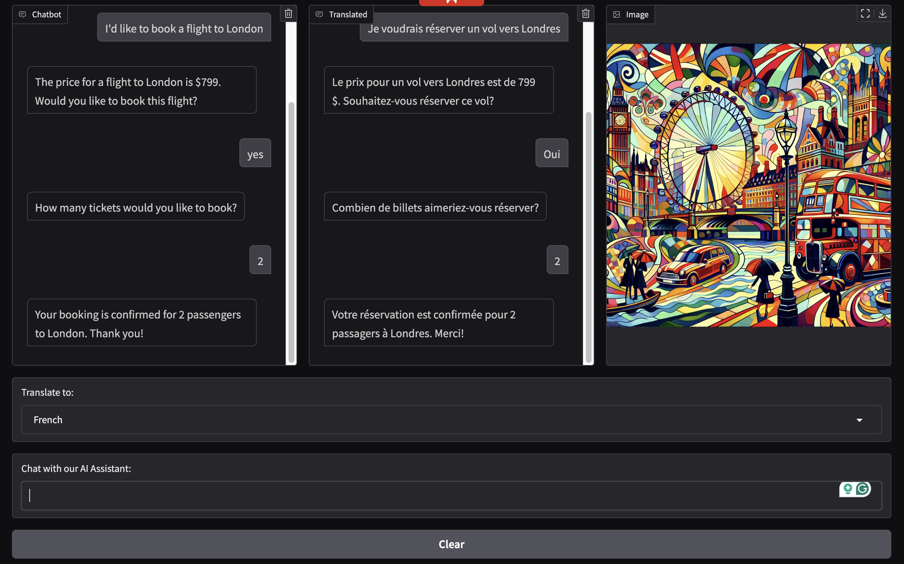

 #### 4.
 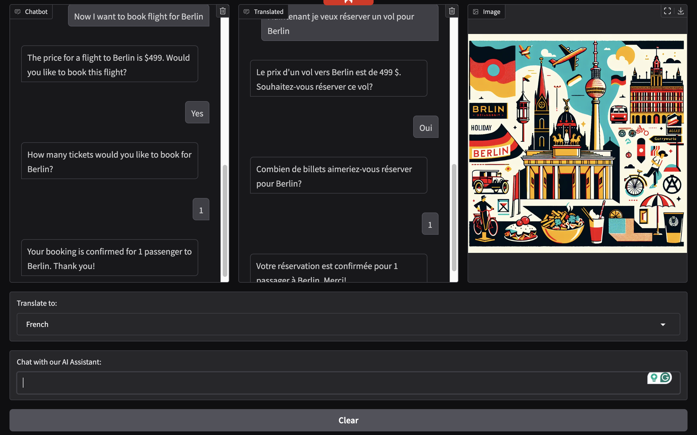

 ## Speech to Text Converter

Here we take audio input and convert speech to text, and back to speech in language of choice.

Example output:
 #### 1.
 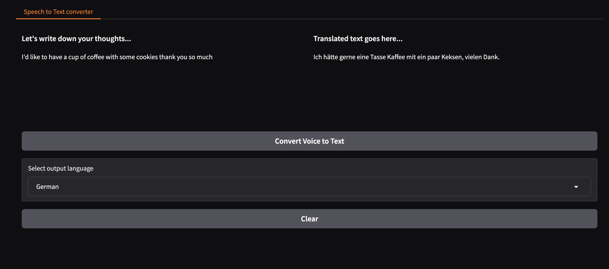

## Dataset Generator

Here we create a dataset generator that uses instruct LLMs, providing a variety of models to choose from. The generator has some input requirements: Topic of the dataset, 3 examples in the format {Instruction: ,Response: } for multi-shot prompting, and the size of the output dataset.

Example output:
 #### Input Prompt 1
 

 #### 1. Output from Meta llama 3.1 Instruct model
 

 #### 2. Output from Mistral AI v0.3 Instruct model
 

 #### 3. Output from Qwen 3 model
 

 #### 4. Output from Gemma 3 model
 

 #### 5. Output from HuggingFace Zephyr-7B-β model
 

**Inference:** Seems like the HuggingFace model was able to give the best result for this prompt, with brief explanation to the approach to solve the python programs. It also looks visually appealing. While Gemma wasn't able to comprehend this prompt completely, it produced a python function incorporating the example prompts and 2 additional prompts to fulfill the dataset size settings. However, Gemma performs pretty well on another prompt which wasn't coding based (see pictures below). 
Depending on your use-case, you can explore different models from the HuggingFace library and choose the one that best suits your needs.

 #### Input Prompt 1
 
 #### 4. Output from Gemma 3 model
 

## Python Code Assistant

Built using Python and Gradio, the tool allows users to input Python code and provides an interactive interface to streamline Python development by automating three key tasks: code execution, comment generation, and unit test creation. 

Example output:

 #### 1. Execute program
 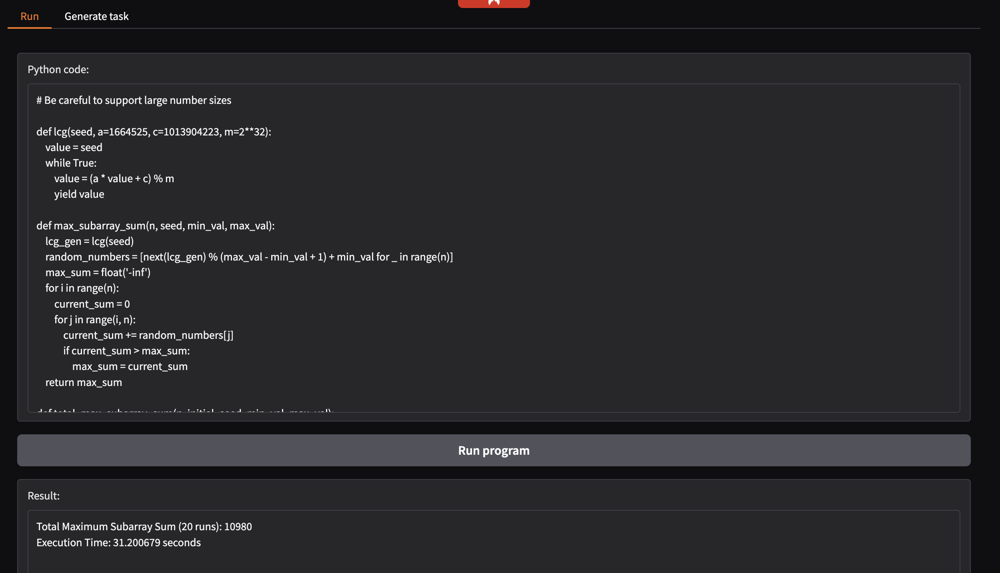

 #### 2. Generate comments
 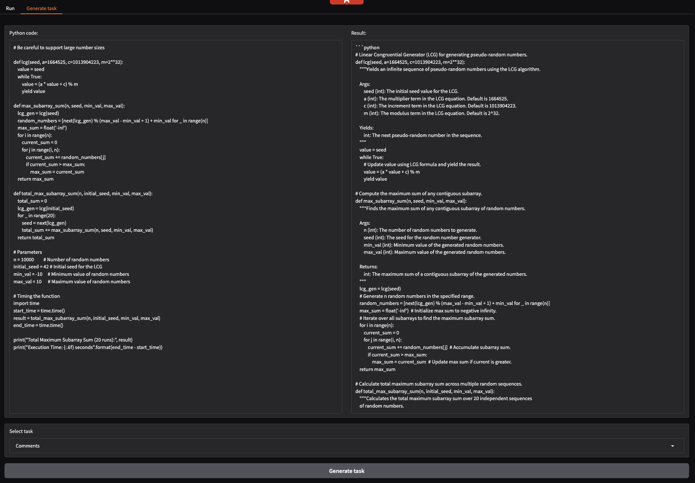

 #### 3. Generate unit tests
 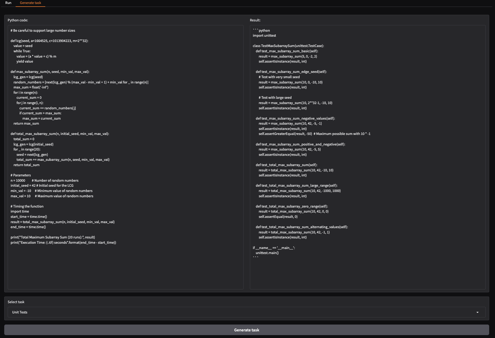

## RAG based Expert Knowledge Worker

Built using Langchain to implement Retrieval Augmented Generation pipeline, to create a smart knowledge worker capable of giving accurate information about the underlying (external) knowledge base.

Example output:
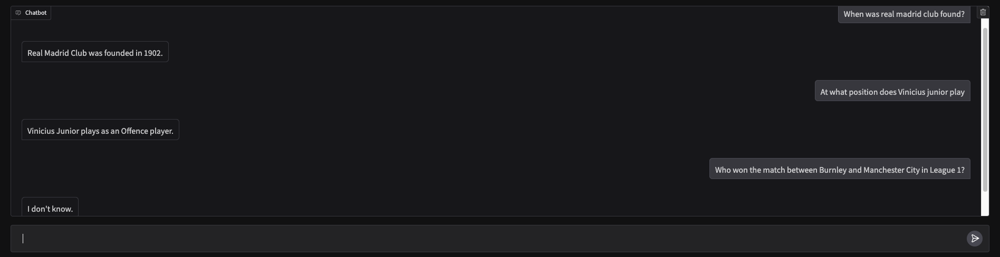